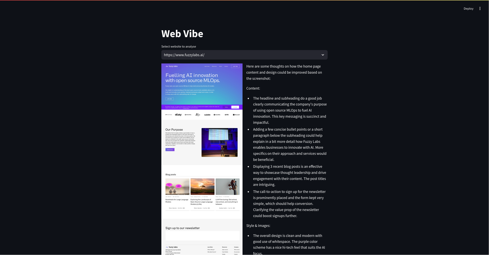

# Web Vibe

Idea: Create a project that helps content writers and graphic designers evaluate their website with help of LLMs.

Check [developer logs](./Developer%20Logs.md) for details on the progress.

## Getting Started

Pre-requisities

- [uv](https://docs.astral.sh/uv/)

## Locally

1. Create a virtual environment and install dependencies using `uv`.

    ```bash
    uv venv --python 3.10
    source .venv/bin/activate
    uv pip install .
    playwright install
    ```

2. Add API secrets to `.env` file.

    ```text
    ANTHROPIC_API_KEY='your-key-here'
    ```

3. Run the python script.

    ```bash
    uv run python main.py
    ```

4. Visualize result using streamlit

    ```bash
    uv run streamlit run visualize_result.py
    ```

## Result


